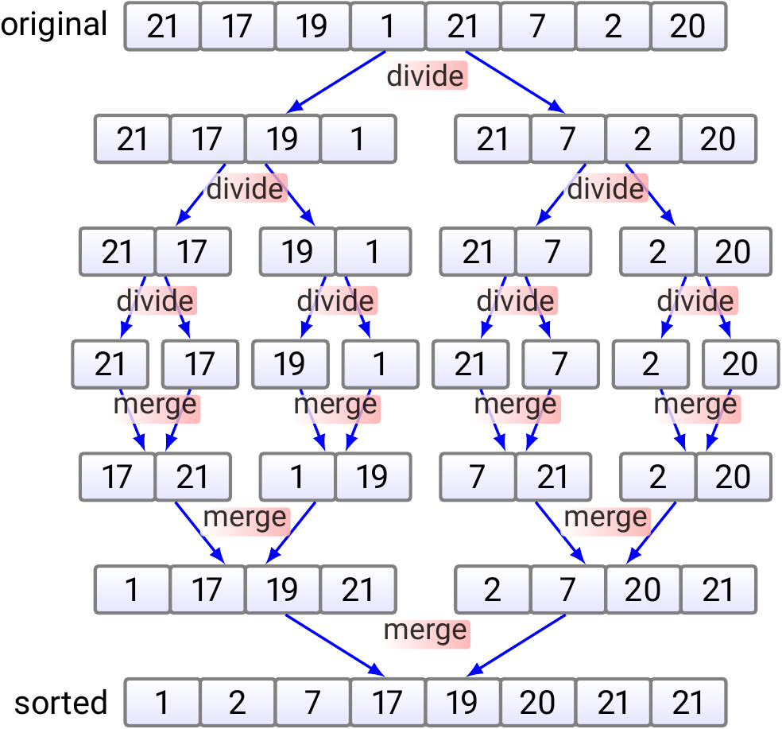

# CUDA Merge Sort Algorithm

Here's a fully parallelized version of the Merge Sort Algorithm made with CUDA. The code also includes a basic sequential MergeSort to compare execution times.

## How it works

Conceptually, a merge sort works as follows:

  1. Divide the unsorted list into n sublists, each containing one element (a list of one element is considered sorted).
  2. Repeatedly merge sublists to produce new sorted sublists until there is only one sublist remaining. This will be the sorted list.

Here each thread take one division till there are no threads or no divisions.

Please note that MakeFile and Job.sh may only work on my server, to reproduce you should make your own compilation files.

